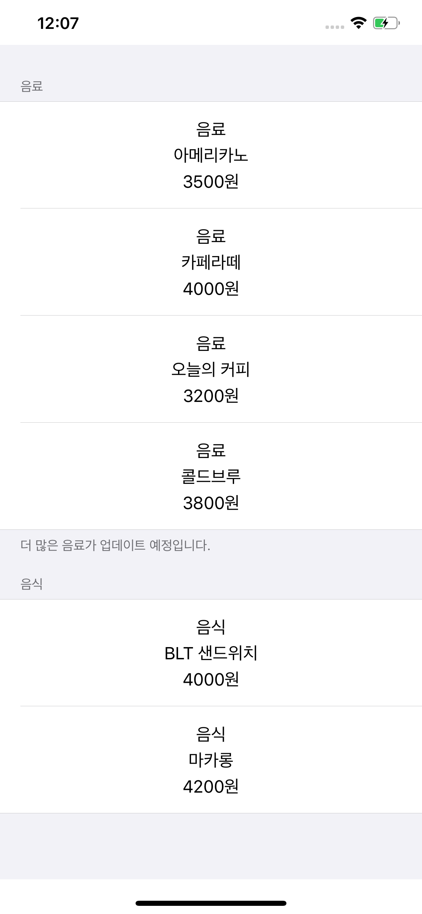

# 2주차 과제
## 결과 화면

## 요청 사항
1. DataSource는 Struct를 사용해서 최대한 간결하게 구현 해보세요.
2. 이번 과제에서는 UITableViewDataSource 뿐만 아니라 UITableViewDelegate 역시 사용합니다.
3. 주요 키워드는 "Swift CustomCell" "UITableView Header / Footer" 정도가 있습니다.
4. 커스텀 셀 내부 레이아웃 역시 AutoLayout으로 설정 해주세요. 이게 은근 난이도가 있습니다.